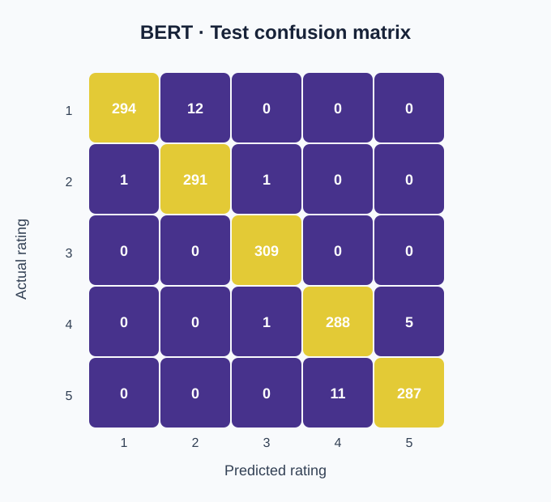

# Product Review Rating Classification
**Python · scikit-learn · PyTorch · Hugging Face Transformers**

A six-stage NLP course project that predicts **1–5 star ratings** from product review text. It compares TF-IDF and word embeddings, classical classifiers, recurrent networks, and fine-tuned Transformers on the same review domain.

## Results

The matrix is derived from saved test output in [the Transformer notebook](06_transformers/06_transformers.ipynb), with class indices 0–4 displayed as ratings 1–5. Results below are recorded experiments, not a new training run or a guarantee on other review datasets.

| Stage | Model | Accuracy | F1-macro |
|---|---|---|---|
| 3 | TF-IDF + Logistic Regression | 0.951–0.966 | ~0.95–0.97 |
| 3 | TF-IDF + Naive Bayes | 0.884 | 0.883 |
| 3 | Word2Vec + Logistic Regression | 0.915 | 0.914 |
| 3 | Word2Vec + Naive Bayes | 0.770 | 0.770 |
| 5 | GRU / BiGRU (packed, Word2Vec-init) | **0.969** | 0.968 |
| 5 | LSTM / BiLSTM (packed, Word2Vec-init) | 0.809 | 0.807 |
| 6 | DistilBERT (fine-tuned) | 0.977 | 0.976 |
| 6 | BERT-base (fine-tuned) | **0.979** | **0.979** |

The recorded BERT result is 97.9% accuracy. TF-IDF with Logistic Regression is also a strong baseline in these experiments. Interpret comparisons alongside each notebook's split, preprocessing, and training configuration; the table alone does not establish performance on independent real-world data.

## Pipeline
| Stage | Focus |
| --- | --- |
| [01 · Preprocessing](01_preprocessing/) | Cleaning, normalization, tokenization, and lemmatization |
| [02 · Representations](02_word_representations/) | PPMI/SVD, Word2Vec, and GloVe |
| [03 · Classical models](03_classical_classification/) | TF-IDF/embedding features, Logistic Regression, and Naive Bayes |
| [04 · Unsupervised analysis](04_unsupervised_and_linguistic_analysis/) | Clustering, topic modeling, and linguistic analysis |
| [05 · Sequence models](05_deep_learning_rnn_lstm/) | RNN, GRU, LSTM, and bidirectional variants |
| [06 · Transformers](06_transformers/) | DistilBERT and BERT fine-tuning and error analysis |

## Reproduce the experiments
1. Clone this repository and create an isolated Python environment.
2. Install the dependencies with `pip install -r requirements.txt`.
3. Obtain the [agentlans/ai-product-reviews dataset](https://huggingface.co/datasets/agentlans/ai-product-reviews).
4. Follow each stage's README and notebook for expected dataset paths and intermediate artifacts.
5. Run stages in order, from preprocessing to Transformers. Training larger models benefits from a GPU.

Notebook outputs provide a way to inspect prior experiments without retraining. Dependency compatibility, downloaded models, compute, and random seeds can affect reproduction.

## Engineering focus
Text preprocessing, representation choice, baseline comparison, sequence handling, model evaluation, and confusion-matrix/error analysis.

## Scope
Research notebooks for a course project. A deployed inference API and evaluation on an independent review corpus are outside the current documented scope.

## Team
Amer Abu Sair · Nour Salah · Shadi Younis
